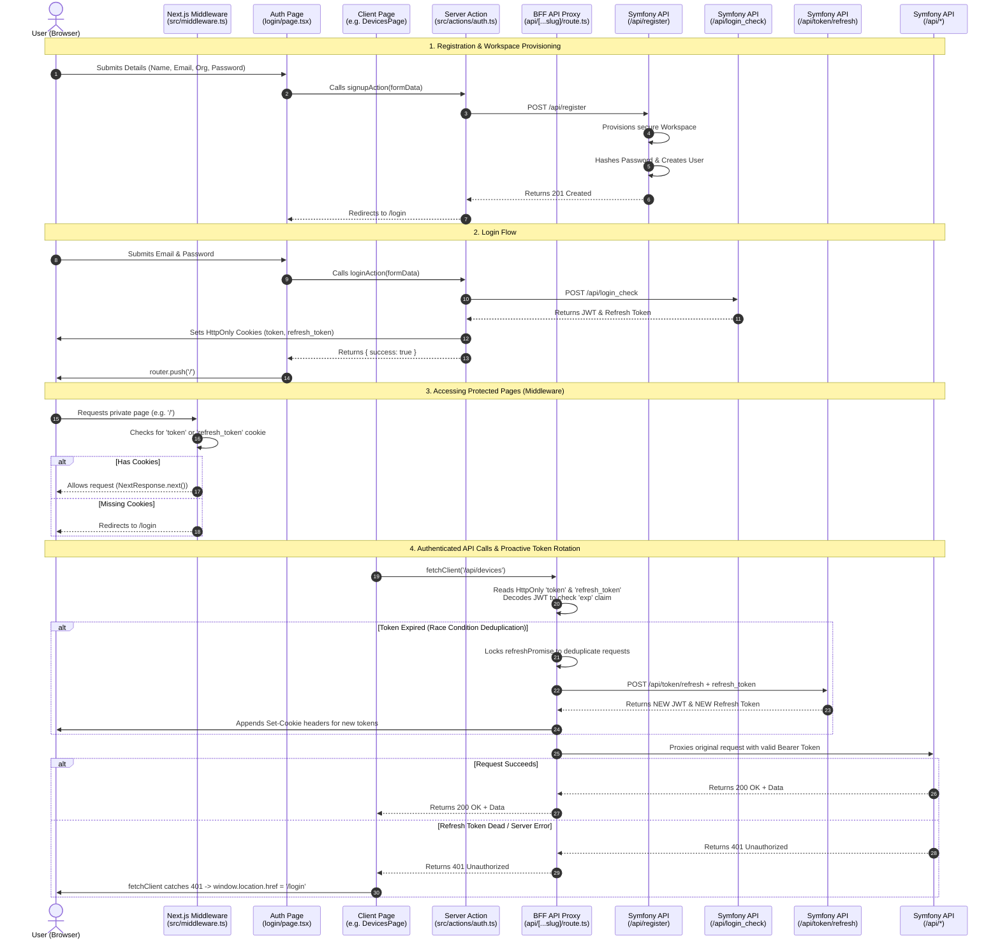

# Authentication Flow Architecture

This document maps out the complete authentication lifecycle between the Plaisoram Next.js Web Frontend and the Symfony Server Backend. It details the steps for logging in, protecting routes, making authenticated requests, and proactively rotating refresh tokens invisibly.

## Sequence Diagram

## Files Involved

### Plaisoram Web (Next.js)
- **`src/app/(auth)/login/page.tsx` & `src/app/(auth)/signup/page.tsx`**: The client-side UI where the user inputs their credentials. They invoke secure Server Actions instead of making direct HTTP requests to the backend.
- **`src/actions/auth.ts`**: The Backend-For-Frontend (BFF) Server Actions. These run on the Node.js server, call the Symfony backend directly to authenticate, and set the strict `HttpOnly`, `Secure` session cookies.
- **`src/middleware.ts`**: Next.js Middleware that intercepts requests to page routes, ensuring the user possesses an active authentication cookie before allowing them to access private dashboards. *(Ensure this file is correctly named and placed in `src/` for Next.js to detect it).*
- **`src/app/api/logout/route.ts`**: API endpoint called by the client to physically delete the HttpOnly cookies when a session dies, ensuring a clean redirect.
- **`src/lib/fetchClient.ts`**: Client-side fetch wrapper that intercepts 401 Unauthorized responses, calls `/api/logout`, and automatically redirects the user back to the login page to prevent broken UI states or infinite redirect loops.
- **`src/app/api/[...slug]/route.ts`**: The Backend-For-Frontend (BFF) API Proxy. Intercepts all client-side calls. It is responsible for:
  - Reading the `HttpOnly` token cookies securely.
  - Proactively checking the JWT expiration (`exp`) claim.
  - Transparently exchanging the `refresh_token` for a new JWT if the current token is expired.
  - **Deduplication:** Uses a global `refreshPromise` lock to ensure multiple simultaneous requests wait for a single refresh, preventing race conditions with `single_use` tokens.
  - Forwarding the request to Symfony (`http://localhost:8000/api/*`) with the valid `Authorization: Bearer <token>` header.

### Plaisoram Server (Symfony)
- **`src/Controller/RegistrationController.php`**: Handles the initial `POST /api/register`. It securely hashes the password, automatically provisions a dedicated `Workspace` for multi-tenant data isolation, and bonds the new user to this Workspace.
- **`src/Controller/*Controller.php`**: Protected endpoints (Devices, Media) automatically extract the `Workspace` from the authenticated user's JWT to guarantee data silos.
- **`config/packages/security.yaml`**: The security nerve center. Configures the `login` firewall (for `json_login`), the `api_token_refresh` firewall, and the stateless `api` firewall. Enforces rate limits (`login_throttling`).
- **`config/packages/gesdinet_jwt_refresh_token.yaml`**: Configures the long-lived refresh tokens with `single_use: true` (token rotation).
- **`src/Entity/User.php` & `src/Entity/RefreshToken.php`**: The Doctrine entities mapping user identities and valid refresh tokens to the database.
