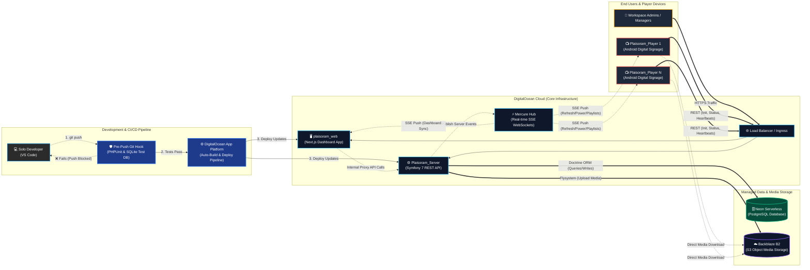
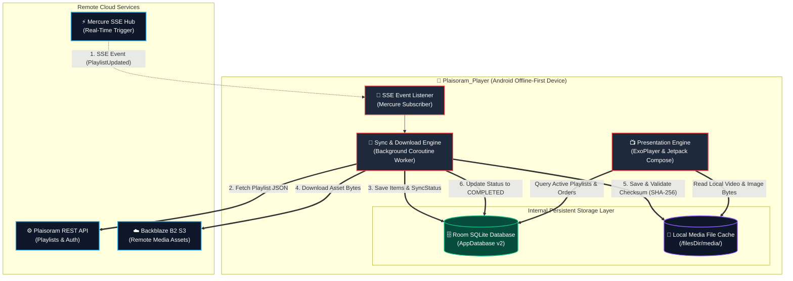

# Plaisoram System Architecture

This document maps the complete system architecture of the **Plaisoram** digital signage platform, covering global cloud infrastructure, real-time networking, and the internal offline-first database architecture of the Android signage players.

---

## 1. Global Cloud & Network Architecture

The global architecture connects workspace managers on the Next.js web dashboard with distributed Android player devices through a Symfony REST API and real-time Mercure SSE WebSockets.

## 2. Android Player Internal Offline-First Architecture

A critical component missing from standard high-level network diagrams is the **internal persistent database and caching layer** of the digital signage player (`Plaisoram_Player`). Because digital signage screens operate in commercial environments where internet connectivity can be intermittent or unstable, the Android player is engineered as an **Offline-First App**.

Instead of streaming video directly from the cloud on every loop, the player uses a local **Room SQLite Database** and an internal **Media File Cache** to ensure continuous, zero-latency playback even during total network outages.

### A. Internal Room SQLite Database (`AppDatabase`)
The player utilizes Android's **Room ORM** (`AppDatabase` v2) to manage persistent local state without relying on server availability. The database consists of two core tables:

1. **`device_config` (`DeviceConfigEntity`)**:
   - Stores the unique device identifier (`deviceId`), screen pairing secret (`screenKey`), pairing status (`isPaired`), configured server URL (`serverUrl`), and cryptographic authentication tokens (`accessToken`, `refreshToken`).
   - Ensures the device survives reboots and power cycles without requiring manual re-authentication by screen technicians.

2. **`playlist_items` (`PlaylistItemEntity`)**:
   - Functions as the local queue and playback schedule. Stores individual media item records including `id`, `playlistId`, `mediaId`, `type` (image/video), `remoteUrl`, `localPath`, `durationSeconds`, `displayOrder`, and expected SHA-256 `checksum`.
   - Tracks real-time sync progression using the `downloadStatus` enum (`PENDING`, `DOWNLOADING`, `COMPLETED`, `FAILED`).

### B. Local Media File Cache (`/filesDir/media/`)
- Managed by `MediaRepositoryImpl`, all remote video and image assets fetched from Backblaze B2 are downloaded directly into internal device storage (`context.filesDir/media/`).
- **Integrity Verification**: As each file completes downloading, the repository calculates its SHA-256 hash and verifies it against the `expectedChecksum` provided by the server. If valid, `localPath` is updated in Room and `downloadStatus` transitions to `COMPLETED`.
- **Zero-Latency Playback**: The UI presentation layer (`ExoPlayer` / Compose canvas) reads video and image streams exclusively from `localPath` on disk. This completely eliminates buffering, bandwidth costs, and playback stuttering.

### C. Real-Time Synchronization Lifecycle
1. **Trigger**: When a workspace manager publishes a new playlist or schedule from `plaisoram_web`, `Plaisoram_Server` pushes a lightweight `PlaylistUpdated` SSE event to the Mercure Hub.
2. **Fetch**: The player's background listener catches the event and invokes `PlaylistRepositoryImpl` to fetch the latest playlist structure from the REST API.
3. **Diff & Download**: The local Room database is updated with new `playlist_items`. Any missing or updated media files are downloaded in the background into `/filesDir/media/`.
4. **Seamless Switch**: Once all items reach `SyncStatus.COMPLETED`, the presentation engine seamlessly transitions to broadcasting the new schedule from local storage.
