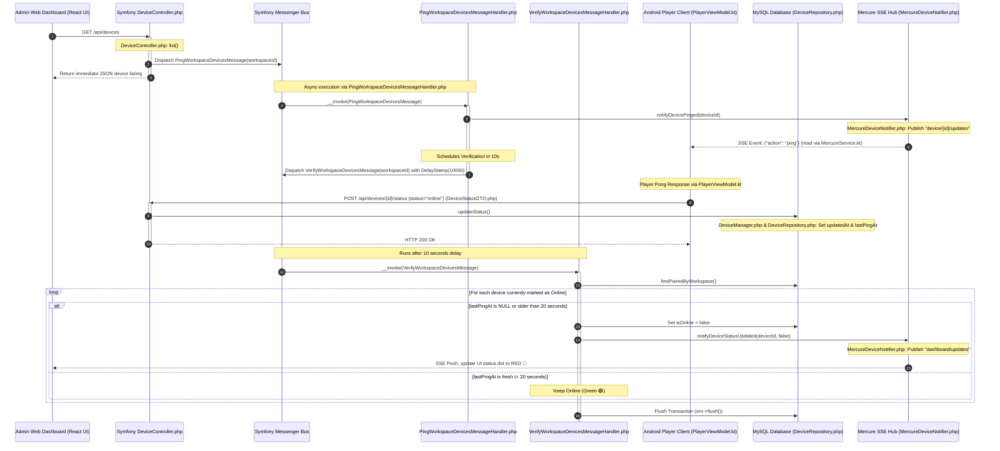
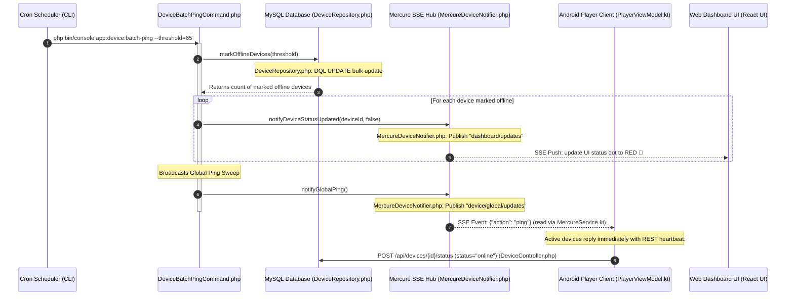
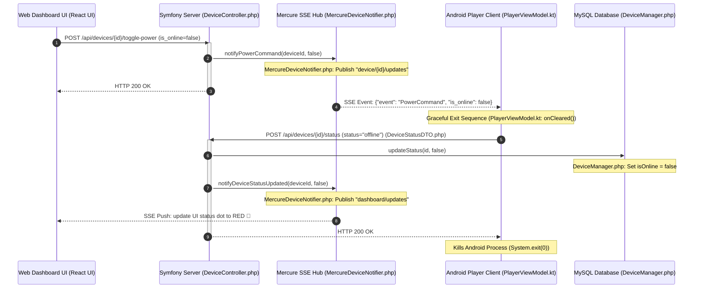

# Plaisoram Screen Health Check & Heartbeat Mechanism

This document provides a comprehensive technical analysis and architectural mapping of the **Screen Health Check** and real-time connectivity monitoring system in the Plaisoram digital signage ecosystem.

---

## 1. Architectural Overview

Plaisoram utilizes a **Dual-Mode Hybrid Ping-Pong Architecture** to monitor and display screen connectivity states in real time:

1. **Active Real-Time Mode (On-Demand Page Load)**: Triggered whenever an administrator views the devices page on the Web Dashboard. It launches a fast, asynchronous ping-and-verify workflow with a 10-second response window managed by the Symfony Messenger message bus.
2. **Passive Background Mode (Stale Inactivity Sweep)**: Driven by a server cron job console command that sweeps globally inactive devices (default threshold: 65 minutes) and broadcasts periodic global pings.
3. **Heartbeat & Event Streams (Mercure SSE & REST)**: Connected Android players maintain active Server-Sent Events (SSE) connections to receive ping requests and reply with HTTP REST heartbeats.

```
                  ┌────────────────────────────────────────────────────────┐
                  │                 ADMINISTRATIVE ACTION                  │
                  │         Admin opens Web Dashboard Devices Page         │
                  └───────────────────────────┬────────────────────────────┘
                                              │
                                              ▼ (HTTP GET /api/devices)
                  ┌────────────────────────────────────────────────────────┐
                  │               ACTIVE REAL-TIME FLOW                    │
                  │  1. Instantly returns registered devices cached state  │
                  │  2. Dispatches asynchronous Ping & Verify messages     │
                  └───────────────────────────┬────────────────────────────┘
                                              │
                    ┌─────────────────────────┴─────────────────────────┐
                    ▼ (Async Queue)                                     ▼ (10s Delayed Queue)
      ┌───────────────────────────┐                         ┌───────────────────────────┐
      │  PingWorkspaceDevices     │                         │  VerifyWorkspaceDevices   │
      │  - Pings all screen SSEs  │                         │  - Checks lastPingAt      │
      └─────────────┬─────────────┘                         │  - Sets offline if stale  │
                    │ (SSE Broadcast)                       └─────────────┬─────────────┘
                    ▼                                                     │
      ┌───────────────────────────┐                                       ▼ (SSE Broadcast)
      │  Android Player Receives  │                          ┌──────────────────────────┐
      │  - Sends status REST Pong ├─────────────────────────►│  Web UI updates status   │
      └───────────────────────────┘    (HTTP POST status)    │  indicator dot in real-   │
                                                             │  time (Green/Red)        │
                                                             └──────────────────────────┘
```

---

## 2. Process Workflows & Sequence Diagrams

### Flow A: Active Real-Time Health Check (Web Page Load / Message Queue)
This flow is triggered dynamically when a user loads the Devices screen on the Next.js Web Dashboard. It ensures that the admin receives fresh connectivity information within 10 seconds.



---

### Flow B: Passive Background Mode (Cron Batch Ping & Clean-up)
This flow runs as a cron job or scheduled console command on the server to clean up stale devices that failed to report or went offline abruptly without sending a disconnect signal.



---

### Flow C: Graceful Disconnection (App Closure / Power Toggle)
When the player app shuts down normally or gets a remote power toggle command, it proactively updates the server to set its state offline immediately, bypassing sweeper timeouts.



---

## 3. Codebase Component Mapping

### A. Plaisoram_Server (Backend)

1. **Active Real-Time Flow Controllers & Handlers**:
   - [DeviceController.php](file:///c:/Users/zrirak/Desktop/Software/Plaisoram/Plaisoram_Server/src/Modules/Device/Controller/DeviceController.php#L35-L52)
     - `list()`: Receives request to display screens, immediately dispatches `PingWorkspaceDevicesMessage` to the bus.
   - [PingWorkspaceDevicesMessageHandler.php](file:///c:/Users/zrirak/Desktop/Software/Plaisoram/Plaisoram_Server/src/Modules/Device/MessageHandler/PingWorkspaceDevicesMessageHandler.php)
     - Dispatches individual SSE `action => ping` commands to each screen.
     - Dispatches delayed `VerifyWorkspaceDevicesMessage` (with `DelayStamp(10000)`).
   - [VerifyWorkspaceDevicesMessageHandler.php](file:///c:/Users/zrirak/Desktop/Software/Plaisoram/Plaisoram_Server/src/Modules/Device/MessageHandler/VerifyWorkspaceDevicesMessageHandler.php)
     - Runs 10 seconds later, sweeps unanswering devices (leeway threshold: 20 seconds), commits them offline in the database, and broadcasts updates via Mercure.

2. **Cron Console Command**:
   - [DeviceBatchPingCommand.php](file:///c:/Users/zrirak/Desktop/Software/Plaisoram/Plaisoram_Server/src/Modules/Device/Command/DeviceBatchPingCommand.php)
     - Implements `app:device:batch-ping`.
     - Performs bulk updates via `DeviceRepository::markOfflineDevices`.
     - Broadcasts global ping sweeps via `notifyGlobalPing`.

3. **Status Receiver**:
   - [DeviceManager.php](file:///c:/Users/zrirak/Desktop/Software/Plaisoram/Plaisoram_Server/src/Modules/Device/Service/DeviceManager.php#L85-L121)
     - `updateStatus(...)`: Updates `updatedAt` (always) and `lastPingAt` (if online). If `isOnline` status changed, persists status and dispatches updates via `notifier`.

4. **SSE Event Publisher**:
   - [MercureDeviceNotifier.php](file:///c:/Users/zrirak/Desktop/Software/Plaisoram/Plaisoram_Server/src/Modules/Device/Service/MercureDeviceNotifier.php)
     - `notifyDevicePinged()`: Pushes `action => ping` to `"device/{id}/updates"`.
     - `notifyGlobalPing()`: Pushes `action => ping` to `"device/global/updates"`.
     - `notifyDeviceStatusUpdated()`: Pushes `DeviceStatusUpdated` to `"dashboard/updates"`.

---

### B. Plaisoram_Player (Android Kotlin Client)

1. **Heartbeat & Event Subscriber**:
   - [PlayerViewModel.kt](file:///c:/Users/zrirak/Desktop/Software/Plaisoram/Plaisoram_Player/app/src/main/java/com/sobrus/plaisoramplayer/presentation/player/PlayerViewModel.kt#L104-L148)
     - Listens to the `mercureRepository.events` stream.
     - Receives `"action" == "ping"` updates and fires `sendHeartbeat(config.deviceId, "online")` asynchronously.
     - Receives `"event" == "PowerCommand"` updates, sends `"offline"` heartbeat, and exits.
     - Dispatches `"online"` heartbeat on startup.
   - [PlayerViewModel.kt](file:///c:/Users/zrirak/Desktop/Software/Plaisoram/Plaisoram_Player/app/src/main/java/com/sobrus/plaisoramplayer/presentation/player/PlayerViewModel.kt#L267-L293)
     - `sendHeartbeat(deviceId, status)`: Makes the HTTP POST request to the backend with body `{ status, currentPlaylistId }`.

---

## 4. Potential Improvements & Optimization Strategy ("Lazy Liveness" Architecture)

Your current architecture is inverted for cost efficiency:
- **Active Mode**: `server asks 100 clients if they are alive` (expensive polling/messaging storm).
- **Proposed Mode**: `100 clients tell the server they are alive every few minutes` (cheap proactive heartbeats).

By moving to a **Lazy Liveness** architecture, you can reduce PostgreSQL database writes, Mercure messages, and Symfony Messenger queue jobs by **90%+**, scaling seamlessly while dropping serverless database costs (Neon) dramatically.

### Core Enhancements:

1. **Player Proactive Heartbeat (5 Minutes instead of 30 Seconds)**
   In `PlayerViewModel.kt`, replace the reactive-only model with a very low-frequency proactive loop:
   ```kotlin
   init {
       // Proactive heartbeat every 5 minutes (300_000 ms)
       viewModelScope.launch {
           while (isActive) {
               delay(300_000)
               val deviceId = deviceState.value?.deviceId
               if (deviceId != null) {
                   sendHeartbeat(deviceId, "online")
               }
           }
       }
   }
   ```
   * **Why**: Reduces player requests to 12 per hour, eliminating Railway CPU and networking overhead.

2. **Database-Write-Free Heartbeat Endpoint**
   Instead of writing `lastPingAt` to PostgreSQL on every status check-in, write to a fast key-value cache buffer (filesystem or Redis) with a TTL of 15 minutes:
   ```php
   public function heartbeat(string $deviceId): Response
   {
       $device = $this->deviceRepository->findByDeviceId($deviceId);
       if (!$device) {
           return new JsonResponse(['error' => 'Not found'], 404);
       }

       // Write to Symfony Cache, NOT PostgreSQL
       $this->cache->set("device.{$deviceId}.last_seen", time(), 900);
       return new JsonResponse(['status' => 'ok']);
   }
   ```
   * **Why**: Zero DB writes for 99% of heartbeats. No WAL traffic, no row bloat, no connection pool exhaustion.

3. **Cron Sweeper Reads Cache, Writes to DB Only on State Changes**
   Run a cron job every 10 minutes that checks the cache. It performs a **single bulk update** to PostgreSQL, but only for devices whose online status actually changed:
   ```php
   $toMarkOffline = [];
   foreach ($devices as $device) {
       $lastSeen = $this->cache->get("device.{$device->getDeviceId()}.last_seen");
       if (!$lastSeen || (time() - $lastSeen) > 900) {
           if ($device->isOnline()) {
               $toMarkOffline[] = $device->getId();
           }
       }
   }
   if (!empty($toMarkOffline)) {
       $this->deviceRepository->bulkMarkOffline($toMarkOffline);
       foreach ($toMarkOffline as $id) {
           $this->notifier->notifyDeviceStatusUpdated($id, false);
       }
   }
   ```
   * **Why**: A few bulk writes every 10 minutes rather than continuous writes every page load.

4. **Kill the Dashboard Auto-Ping**
   Remove the automatic `PingWorkspaceDevicesMessage` dispatch from `DeviceController::list()`. The admin can view the cached state (accurate within ~10 minutes). An optional "Check Now" button can trigger pings on-demand.

5. **Sync Engine Optimization**
   Only synchronize the player on Mercure `PlaylistUpdated` SSE events, letting the periodic sync engine act as a slow 5-minute fallback rather than a high-frequency polling thread.

---

### Before vs. After Comparison Table

| Metric | Current Architecture | Optimized Architecture |
| :--- | :--- | :--- |
| **DB writes per hour (50 screens)** | ~300–600 (active pongs) | ~0–20 (state transitions only) |
| **Mercure SSE messages per page load** | 50–100 | 0 |
| **Messenger queue jobs per page load** | 50–100 | 0 |
| **Neon WAL traffic / compute** | High | Minimal |
| **Offline detection latency** | ~10 seconds | ~10–15 minutes |
| **Cost Profile** | Expensive scale | High efficiency / low cost |
