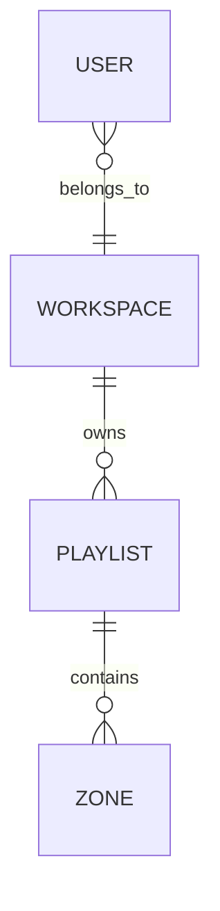

# Playlist Management in Plaisoram

This document outlines how playlists are architected, processed, validated, and rendered across the **Plaisoram** workspace (Next.js Dashboard, Symfony Backend, and Android TV Player).

---

## 1. Relational Database Architecture

Playlists are managed in the Symfony backend via a structured relationship between **Workspaces**, **Playlists**, and **Zones**.

### Entities

#### `Playlist` (`App\Entity\Playlist`)
- **`id`**: Unique integer identifier.
- **`name`**: Unique string name (unique *per workspace*).
- **`workspace`**: ManyToOne relationship to `Workspace` (nullable).
  - If `workspace === null`, the playlist is classified as a **Global Playlist** available to all tenants.
- **`layoutType`**: Describes the layout template grid (e.g., `main_sidebar`, `header_main`, `two_main_sidebar_footer`).
- **`resolutionX` / `resolutionY`**: Width and height dimensions of the screen layout target (e.g., 1920x1080).

#### `Zone` (`App\Entity\Zone`)
- **`playlist`**: ManyToOne relationship to `Playlist` (cascade deleted when the playlist is deleted).
- **`name`**: Visual label (e.g., "Main", "Sidebar", "Header").
- **`xPercent`, `yPercent`, `widthPercent`, `heightPercent`**: Percentage coordinates (0-100) defining where this zone is rendered on the target layout grid.
- **`zoneKey`**: Logical identifier mapping the zone back to frontend structures.
- **`mediaId`**: Integer pointing to the `Media` entity assigned to this zone.

---

## 2. Business Logic & Constraints

To protect templates and prevent collision, several rules are enforced by the application:

### A. The Global "Default playlist"
- **Properties**: Name is exactly `"Default playlist"`, and `workspace` is `null`.
- **Availability**: Every user fetches and displays this playlist in their dashboard by default.
- **Immutability**: 
  - Cannot be edited or updated.
  - Cannot be deleted.
  - Can be **Duplicated** by any user, which generates a workspace-specific copy that *can* be modified.

### B. Name Uniqueness
- Every playlist created within a workspace must have a unique name.
- The name `"Default playlist"` is globally reserved and cannot be used when creating workspace-specific playlists.

### C. Duplication Rules
- When duplicating any playlist:
  - All coordinates, layout types, resolutions, and zone properties (including associated media) are copied to a new playlist entity.
  - The workspace is assigned to the current user's workspace.
  - The name is appended with `" Copy"`. If that name is already occupied in the workspace, it appends a numbered increment, e.g., `"Default Playlist Copy (1)"`.

---

## 3. Backend Endpoints (`PlaylistController`)

All dashboard API requests are tunneled through the Next.js API proxy (`/api/[...slug]/route.ts`) to the Symfony REST API at `#[Route('/api/playlists')]`.

| Method | Endpoint | Description | Constraints & Safeguards |
| :--- | :--- | :--- | :--- |
| **GET** | `/api/playlists` | Fetch all available playlists. | Returns user's workspace playlists **AND** global playlists (`workspace IS NULL`). |
| **POST** | `/api/playlists` | Create a new playlist. | Checks name uniqueness per workspace and blocks reserved name `"Default playlist"`. |
| **POST** | `/api/playlists/{id}/duplicate` | Replicate an existing playlist. | Copies layout/zones. Autogenerates unique names. Works on global default too. |
| **DELETE** | `/api/playlists/{id}` | Delete a playlist. | Deletes all associated zones first. Blocks deletion of the global `"Default playlist"`. |

---

## 4. Frontend Management (Next.js Dashboard)

The playlist pages are situated under `plaisoram_web/src/app/(dashboard)/playlists`.

### List Dashboard (`/playlists/page.tsx`)
- Displays all workspace and global playlists using a dynamic `useEffect` fetch.
- **Safeguards**:
  - The **Edit** and **Delete** buttons are conditionally disabled/hidden if `playlist.isDefault === true` or `playlist.name === "Default playlist"`.
  - The **Duplicate** button is always enabled and fires a `POST` request to the backend duplication endpoint, immediately refreshing the view.

### Layout Builder (`/playlists/editLayout/page.tsx`)
- Provides the drag-and-resize builder interface.
- Contains the **Interactive TV Canvas** mapping out the absolute dimensions and positioning of layout zones.
- **Media Assignment**: Allows users to bind specific images and video assets to each zone.
- **Resolution targets**: Pulled dynamically from physical devices to allow pixel-perfect mapping.

---

## 5. TV Screen Layout Stretching

To ensure layout fidelity between the web dashboard editor and the Android TV player box:
- Both the Web `TVCanvas.tsx` (`object-fill`) and the Android Player (`ContentScale.FillBounds` / `RESIZE_MODE_FILL`) are set to **stretch** media assets to perfectly fit the boundaries of their respective zone.
- This ensures that whatever resolution of image or video is assigned to a layout zone, it adapts identically on the target screen.
