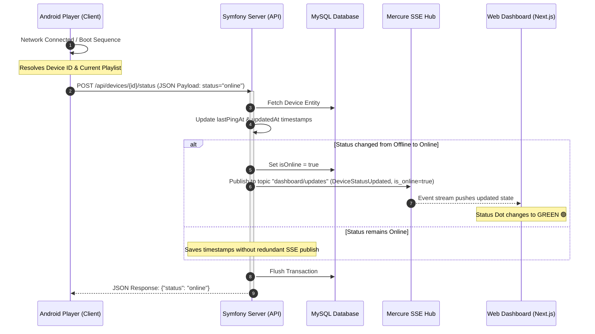
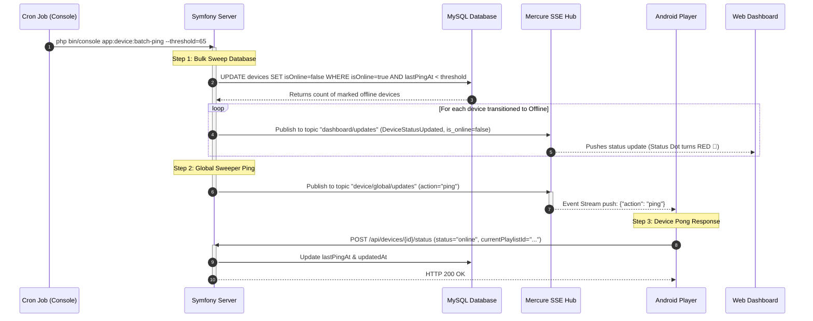
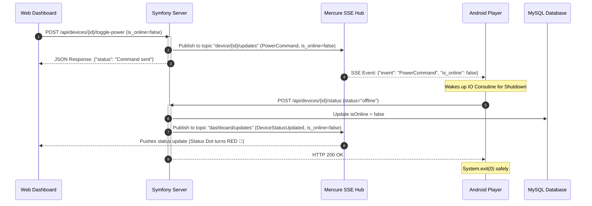

# Plaisoram Screen Health Check & Heartbeat Mechanism

This document provides a comprehensive technical analysis and architectural mapping of the **Screen Health Check** and real-time status reporting system in the Plaisoram digital signage ecosystem. 

---

## 1. Architectural Overview

Plaisoram implements a **Hybrid Push-Pull Ping-Pong Architecture** that combines:
1. **Periodic REST Heartbeats (Push)** initiated by the Android player.
2. **Real-Time Mercure SSE Subscriptions (SSE Listeners)** for immediate bi-directional event notifications.
3. **Scheduled Inactivity Sweeps & Global Ping Sweeps (Pull/Cron)** driven by the Symfony console command.
4. **Reactive Web Dashboard updates** that update UI components (Online/Offline statuses) in real time without refreshing the page.

```
┌─────────────────┐             ┌─────────────────┐             ┌──────────────────┐
│                 │  Heartbeats │                 │   Mercure   │                  │
│ Android Player  ├────────────►│ Symfony Server  ├────────────►│  Web Dashboard   │
│ (Active Screen) │             │ (MySQL + Cache) │  Updates    │ (Next.js Client) │
│                 │◄────────────┤                 │             │                  │
└─────────────────┘  Global     └────────┬────────┘             └──────────────────┘
                     Ping sweeps         │
                                         ▼
                                  ┌──────────────┐
                                  │ Batch Ping   │
                                  │ Cron Command │
                                  └──────────────┘
```

---

## 2. Process Workflows & Sequence Diagrams

### Flow A: Device Boot & Initial Heartbeat Registration
When the Android Player boots up, connects to a network, or undergoes a playback transition, it sends a heartbeat to notify the server of its status.



---

### Flow B: Scheduled Inactivity Sweep & Global Ping-Pong Cycle
To ensure that disconnected screens are marked offline dynamically, a scheduled sweeper script runs on the server (typically every 15–30 minutes).



---

### Flow C: Remote Power Shutdown Transition
When an admin toggles a device off from the web dashboard, the player shuts down gracefully, reporting its offline state before exit.



---

## 3. Codebase Component Mapping

### A. Plaisoram_Server (Backend)

1. **Scheduled CLI Sweeper**: 
   - [DeviceBatchPingCommand.php](file:///c:/Users/zrirak/Desktop/Software/Plaisoram/Plaisoram_Server/src/Modules/Device/Command/DeviceBatchPingCommand.php)
     - Implements the `app:device:batch-ping` command.
     - Performs the bulk updates in database to clean stale devices.
     - Triggers the global ping broadcast `notifyGlobalPing()`.
2. **Database Querying Layer**:
   - [DeviceRepository.php](file:///c:/Users/zrirak/Desktop/Software/Plaisoram/Plaisoram_Server/src/Modules/Device/Repository/DeviceRepository.php#L59-L81)
     - Implements `markOfflineDevices(\DateTimeImmutable $threshold)` using Doctrine DQL:
       ```php
       $this->createQueryBuilder('d')
            ->update()
            ->set('d.isOnline', ':false')
            ->where('d.isOnline = :true')
            ->andWhere('d.lastPingAt < :threshold OR (d.lastPingAt IS NULL AND d.updatedAt < :threshold)')
       ```
3. **API Routing Gate**:
   - [DeviceController.php](file:///c:/Users/zrirak/Desktop/Software/Plaisoram/Plaisoram_Server/src/Modules/Device/Controller/DeviceController.php#L73-L83)
     - Implements `POST /api/devices/{id}/status` routing map.
4. **State Manager & Notifier**:
   - [DeviceManager.php](file:///c:/Users/zrirak/Desktop/Software/Plaisoram/Plaisoram_Server/src/Modules/Device/Service/DeviceManager.php#L85-L121)
     - Updates device fields (`lastPingAt`, `updatedAt`).
     - Decides whether status changes justify an SSE push to the dashboard.
   - [MercureDeviceNotifier.php](file:///c:/Users/zrirak/Desktop/Software/Plaisoram/Plaisoram_Server/src/Modules/Device/Service/MercureDeviceNotifier.php#L25-L50)
     - Sends `DeviceStatusUpdated` payloads to the `"dashboard/updates"` topic.
     - Sends `action => ping` payloads to the `"device/global/updates"` topic.

---

### B. Plaisoram_Player (Android Signage Client)

1. **SSE Update Listener**:
   - `MercureService.kt`
     - Subscribes to the server update topics via a long-lived HTTP client stream.
     - Manages connection reliability and parses updates.
2. **Lifecycle Heartbeat Dispatcher**:
   - [PlayerViewModel.kt](file:///c:/Users/zrirak/Desktop/Software/Plaisoram/Plaisoram_Player/app/src/main/java/com/sobrus/plaisoramplayer/presentation/player/PlayerViewModel.kt#L104-L148)
     - Consumes events from the `mercureRepository`.
     - When receiving the `action == "ping"` update payload, it spawns an IO coroutine invoking `sendHeartbeat(config.deviceId, "online")`.
     - When receiving the `PowerCommand` (shutdown) payload, it updates `_isPoweredOn`, reports `sendHeartbeat(deviceId, "offline")` synchronously via `runBlocking`, and calls `System.exit(0)`.
     - Dispatches an initial `"online"` heartbeat on startup.

---

### C. plaisoram_web (Web Frontend)

1. **Proxy Endpoint**:
   - `src/app/api/[...slug]/route.ts`
     - Proxies the status request `/api/devices/{id}/status` and returns data safely.
2. **Dashboard Updates Listener**:
   - Real-time components in the React page subscribe to the Mercure Hub topic `dashboard/updates`.
   - Listens for `'DeviceStatusUpdated'` event, automatically updating the state grid to show real-time connectivity status dot changes (online/offline).
