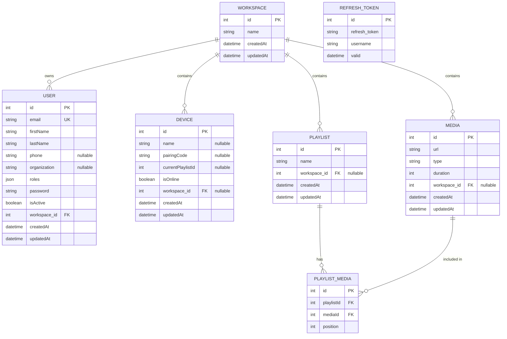

# Plaisoram Database Schema

This document represents the current state of the Plaisoram database schema, including the multi-tenancy updates linking Users, Devices, Media, and Playlists to Workspaces.

## Entity-Relationship Diagram



## DBML (Database Markup Language) Definition

```dbml
Table workspace {
  id int [pk, increment]
  name varchar(255)
  createdAt datetime
  updatedAt datetime
}

Table user {
  id int [pk, increment]
  email varchar(180) [unique]
  firstName varchar(255)
  lastName varchar(255)
  phone varchar(255) [null]
  organization varchar(255) [null]
  roles json
  password varchar(255)
  isActive boolean [default: true]
  workspace_id int [not null]
  createdAt datetime
  updatedAt datetime
}

Table refresh_tokens {
  id int [pk, increment]
  refresh_token varchar(128) [unique]
  username varchar(255)
  valid datetime
}

Table device {
  id int [pk, increment]
  name varchar(255) [null]
  pairingCode varchar(255) [null]
  currentPlaylistId int [null]
  isOnline boolean [default: true]
  workspace_id int [null]
  createdAt datetime
  updatedAt datetime
}

Table media {
  id int [pk, increment]
  url varchar(255)
  type varchar(50)
  duration int
  workspace_id int [null]
  createdAt datetime
  updatedAt datetime
}

Table playlist {
  id int [pk, increment]
  name varchar(255)
  workspace_id int [null]
  createdAt datetime
  updatedAt datetime
}

Table playlist_media {
  id int [pk, increment]
  playlistId int
  mediaId int
  position int
}

// Relationships
Ref: user.workspace_id > workspace.id
Ref: device.workspace_id > workspace.id
Ref: media.workspace_id > workspace.id
Ref: playlist.workspace_id > workspace.id
Ref: playlist_media.playlistId > playlist.id
Ref: playlist_media.mediaId > media.id
```
