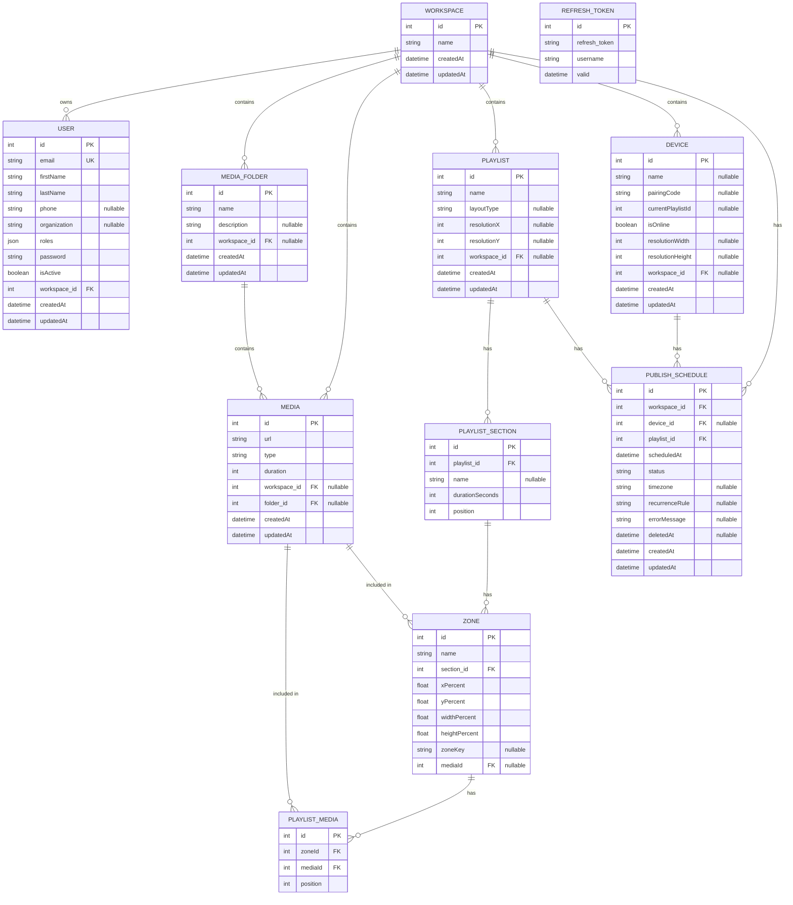
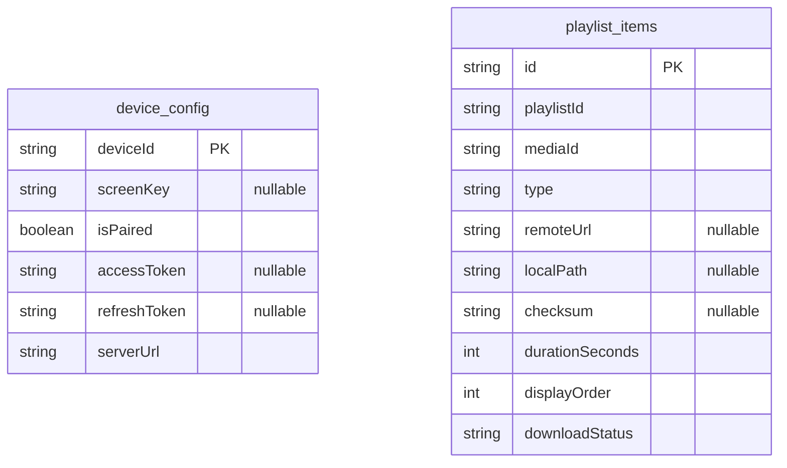

# Plaisoram Database Schema

This document represents the current state of the Plaisoram database schemas for both the **Server Backend** and the **Digital Player App**.

## 1. Server Database Schema

This schema handles the multi-tenancy architecture, linking Users, Devices, Media, and Playlists to Workspaces, as well as the layout and zone structures for digital signage.

### Entity-Relationship Diagram



### DBML (Database Markup Language) Definition

```dbml
Table workspace {
  id int [pk, increment]
  name varchar(255)
  createdAt datetime
  updatedAt datetime
}

Table user {
  id int [pk, increment]
  email varchar(180) [unique]
  firstName varchar(255)
  lastName varchar(255)
  phone varchar(255) [null]
  organization varchar(255) [null]
  roles json
  password varchar(255)
  isActive boolean [default: true]
  workspace_id int [not null]
  createdAt datetime
  updatedAt datetime
}

Table refresh_tokens {
  id int [pk, increment]
  refresh_token varchar(128) [unique]
  username varchar(255)
  valid datetime
}

Table device {
  id int [pk, increment]
  name varchar(255) [null]
  pairingCode varchar(255) [null]
  currentPlaylistId int [null]
  isOnline boolean [default: true]
  resolutionWidth int [null]
  resolutionHeight int [null]
  workspace_id int [null]
  createdAt datetime
  updatedAt datetime
}

Table media_folder {
  id int [pk, increment]
  name varchar(255)
  description varchar(255) [null]
  workspace_id int [null]
  createdAt datetime
  updatedAt datetime
}

Table media {
  id int [pk, increment]
  url varchar(255)
  type varchar(50)
  duration int
  workspace_id int [null]
  folder_id int [null]
  createdAt datetime
  updatedAt datetime
}

Table playlist {
  id int [pk, increment]
  name varchar(255)
  layoutType varchar(255) [null]
  resolutionX int [null]
  resolutionY int [null]
  workspace_id int [null]
  createdAt datetime
  updatedAt datetime
}

Table playlist_section {
  id int [pk, increment]
  playlist_id int [not null]
  name varchar(255) [null]
  durationSeconds int [default: 3600]
  position int [default: 1]
}

Table zone {
  id int [pk, increment]
  name varchar(255)
  section_id int [not null]
  xPercent float
  yPercent float
  widthPercent float
  heightPercent float
  zoneKey varchar(100) [null]
  mediaId int [null]
}

Table playlist_media {
  id int [pk, increment]
  zoneId int
  mediaId int
  position int
}

Table publish_schedule {
  id int [pk, increment]
  workspace_id int [not null]
  device_id int [null]
  playlist_id int [not null]
  scheduledAt datetime [not null]
  status varchar(50) [default: 'pending']
  timezone varchar(100) [null]
  recurrenceRule varchar(255) [null]
  errorMessage text [null]
  deletedAt datetime [null]
  createdAt datetime
  updatedAt datetime
}

// Relationships
Ref: user.workspace_id > workspace.id
Ref: device.workspace_id > workspace.id
Ref: media_folder.workspace_id > workspace.id
Ref: media.workspace_id > workspace.id
Ref: media.folder_id > media_folder.id
Ref: playlist.workspace_id > workspace.id
Ref: playlist_section.playlist_id > playlist.id
Ref: zone.section_id > playlist_section.id
Ref: zone.mediaId > media.id
Ref: playlist_media.zoneId > zone.id
Ref: playlist_media.mediaId > media.id
Ref: publish_schedule.workspace_id > workspace.id
Ref: publish_schedule.device_id > device.id
Ref: publish_schedule.playlist_id > playlist.id
```

## 2. Digital Player App Database Schema

This schema handles the local caching of playlists, media synchronization status, device configuration, and widget data (weather, news) on the Android Digital Signage Player using a Room SQLite database.

### Entity-Relationship Diagram



### DBML (Database Markup Language) Definition

```dbml
Table device_config {
  deviceId varchar(255) [pk]
  screenKey varchar(255) [null]
  isPaired boolean
  accessToken text [null]
  refreshToken text [null]
  serverUrl varchar(255)
}

Table playlist_items {
  id varchar(255) [pk]
  playlistId varchar(255)
  mediaId varchar(255)
  type varchar(50)
  remoteUrl varchar(255) [null]
  localPath varchar(255) [null]
  checksum varchar(255) [null]
  durationSeconds int
  displayOrder int
  downloadStatus varchar(50)
}
```
