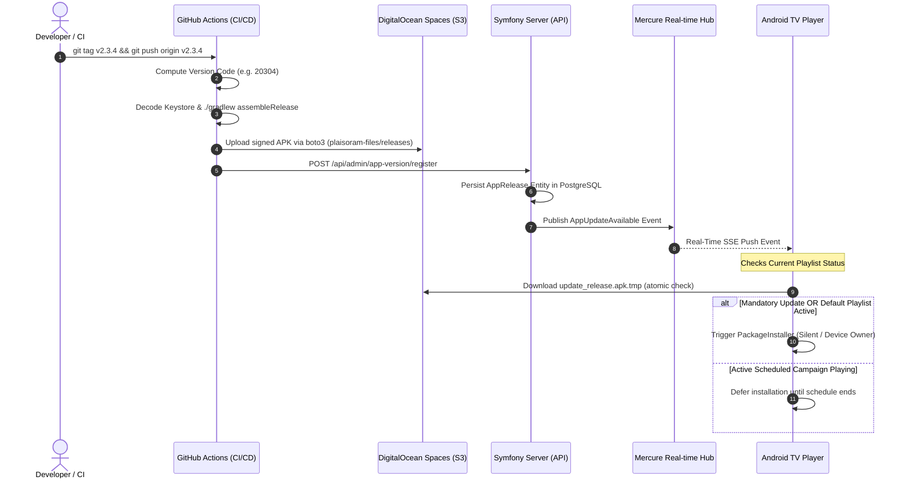

# Plaisoram OTA (Over-The-Air) Update Architecture

## Overview

The **OTA (Over-The-Air) Update System** provides a fully automated, zero-touch continuous deployment pipeline for the Plaisoram Android TV Player fleet.

Whenever a developer tags and pushes a new version in Git, the system automatically builds, signs, hosts, registers, and broadcasts the update to all active screens in the field without any manual intervention or screen interruptions.

---

## 1. End-to-End Architecture & Flow



---

## 2. Core Components & Responsibilities

### A. GitHub Actions Pipeline (`.github/workflows/build-release-apk.yml`)
* **Trigger:** Triggered automatically whenever a tag matching `v*.*.*` is pushed.
* **Semantic Version Code Calculation:** Calculates an integer `versionCode` using the standard semantic formula:
  $$\text{versionCode} = (\text{MAJOR} \times 10000) + (\text{MINOR} \times 100) + \text{PATCH}$$
  *(e.g., `v2.3.4` $\rightarrow$ `20304`).*
* **Build & Signing:** Decodes the production keystore secret (`RELEASE_KEYSTORE_BASE64`), runs `./gradlew assembleRelease`, and cleans up keystore credentials immediately.
* **S3 Hosting:** Uses Python `boto3` to upload the APK directly to DigitalOcean Spaces with `ACL=public-read`.
* **API Registration:** Issues an authenticated `POST /api/admin/app-version/register` request to the Symfony production server.

---

### B. Cloud Storage: DigitalOcean Spaces (S3)
* **Bucket Name:** `plaisoram-files`
* **Region:** Frankfurt (`fra1`)
* **Endpoint:** `https://fra1.digitaloceanspaces.com`
* **Public File URL:** `https://plaisoram-files.fra1.digitaloceanspaces.com/releases/plaisoram-player-vX.Y.Z.apk`

---

### C. Backend Server: Symfony (`AppReleaseController.php`)
* **Database Entity (`AppRelease`):**
  * `versionCode` (int) - The sequential build number used for comparison.
  * `versionName` (string) - Human-readable version string (e.g. `2.3.4`).
  * `apkUrl` (string) - Public download link on DigitalOcean Spaces.
  * `isMandatory` (bool) - Flag forcing instant installation without waiting for playlist boundaries.
  * `releaseNotes` (text) - Optional description of changes.
* **Key Endpoints:**
  * `POST /api/admin/app-version/register`: Protected by secret `X-API-KEY`. Stores the new release and notifies Mercure.
  * `GET /api/app-version/latest?currentVersionCode=20300`: Public endpoint queried by Android TVs on boot or network reconnection.

---

### D. Real-Time Hub: Mercure (`AppUpdateAvailable`)
* **Topic:** `device/{deviceId}/updates` and `global/updates`
* **Event:** `AppUpdateAvailable`
* **Payload Structure:**
```json
{
  "event": "AppUpdateAvailable",
  "versionCode": 20304,
  "versionName": "2.3.4",
  "apkUrl": "https://plaisoram-files.fra1.digitaloceanspaces.com/releases/plaisoram-player-v2.3.4.apk",
  "isMandatory": false
}
```

---

### E. Android TV Client (`OtaUpdateManager.kt`)

The Android Player uses a **Hybrid Push + Pull** update mechanism:

1. **Push Strategy (Real-time):**
   * `MercureService.kt` listens to Server-Sent Events (SSE).
   * Upon receiving `AppUpdateAvailable`, `OtaUpdateManager` triggers background download.

2. **Pull Strategy (Boot & Reconnection Guard):**
   * When a TV box is turned off at night or disconnected from Wi-Fi during a release, it calls `checkForUpdatesOnStartup()` on cold boot.
   * Includes an automatic retry loop (with 5-second backoff) to account for TV box Wi-Fi startup latency.

3. **Smart Installation Policy (Zero Disruption):**
   * **Scheduled Commercial Campaigns Active:** The update is downloaded to disk, and installation is safely deferred.
   * **Default Playlist Active (`playlistId == null`):** The update installs automatically.
   * **Mandatory Flag (`isMandatory = true`):** Critical security/bug fixes install immediately.

4. **Crash Loop Protection & Stability Guard:**
   * Tracks cold boot timestamps. If the app crashes 3 consecutive times within 10 seconds of startup, the pending update is cancelled and rolled back to preserve signage availability.
   * Once 15 seconds of smooth playback elapse, `markAppStable()` resets the counter.

5. **Download Integrity:**
   * Downloads to a temporary file (`update_release.apk.tmp`) and validates `Content-Length` before atomically renaming to `update_release.apk`.

---

## 3. How to Release a New Version

To deploy a new update to all screens across the fleet, simply push a new Git tag from the `Plaisoram_Player` repository:

```bash
# 1. Ensure working tree is clean and committed
git push origin main

# 2. Create a semantic tag (must match v*.*.*)
git tag v2.3.5

# 3. Push the tag to GitHub
git push origin v2.3.5
```

### What Happens Next (Automated):
1. GitHub Actions triggers the `Build & Publish Production Release APK` workflow.
2. The release APK is generated and uploaded to DigitalOcean Spaces in ~2 minutes.
3. Symfony registers the release and broadcasts it via Mercure.
4. All online TV screens download and apply the update seamlessly.

---

## 4. Permissions & Silent Installation Modes

Android OS enforces package installation restrictions depending on whether the app runs as a standard app or as a Device Owner:

| Installation Mode | Requirements | User Experience |
| :--- | :--- | :--- |
| **Standard Mode** | `REQUEST_INSTALL_PACKAGES` permission toggled ON once in Android Settings. | Shows a brief native system prompt to confirm the update. |
| **Enterprise / Device Owner Mode** | Device Owner provisioned via ADB (`dpm set-device-owner`). | **100% Silent Background Installation** via Android `PackageInstaller` API with zero prompts or dialogs. |

### Provisioning Device Owner Mode (Optional for Silent Installs):
```bash
adb shell dpm set-device-owner com.sobrus.plaisoramplayer/.data.remote.AdminReceiver
```

---

## 5. Troubleshooting & Best Practices

1. **"Un problème est survenu lors de l'analyse du package" (Parse Error / Signature Mismatch):**
   * **Cause:** Trying to install a production **Release APK** over a local development **Debug APK** (Android prevents mixing signature certificates).
   * **Solution:** Uninstall the debug build once (`adb uninstall com.sobrus.plaisoramplayer`) and install the signed release build. All subsequent OTA updates will share the same production certificate.

2. **Verifying Active Release Status:**
   * Open the Web Dashboard at `/settings/releases` to view the currently active fleet release version and direct APK download URL.
