# Plaisoram Business Workflows

This document outlines the core business processes of the Plaisoram ecosystem (Web App, Server, and Player). The diagrams use standard BPMN-style flowcharts via Mermaid syntax to illustrate the step-by-step interactions between the various components.

---

## 1. Account Creation (Individual or Enterprise)

The registration process allows users to create an account and a dedicated Workspace. Depending on the account type, different details are required, but they funnel into the same manager.

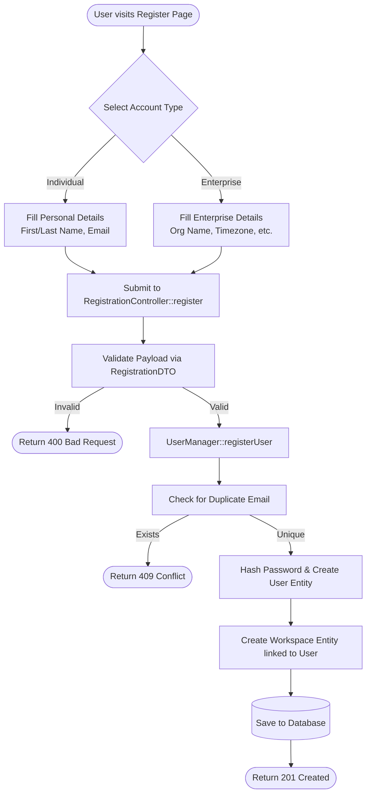

---

## 2. Authentication and Redirection

Standard JWT-based authentication flow used by the Web Dashboard.

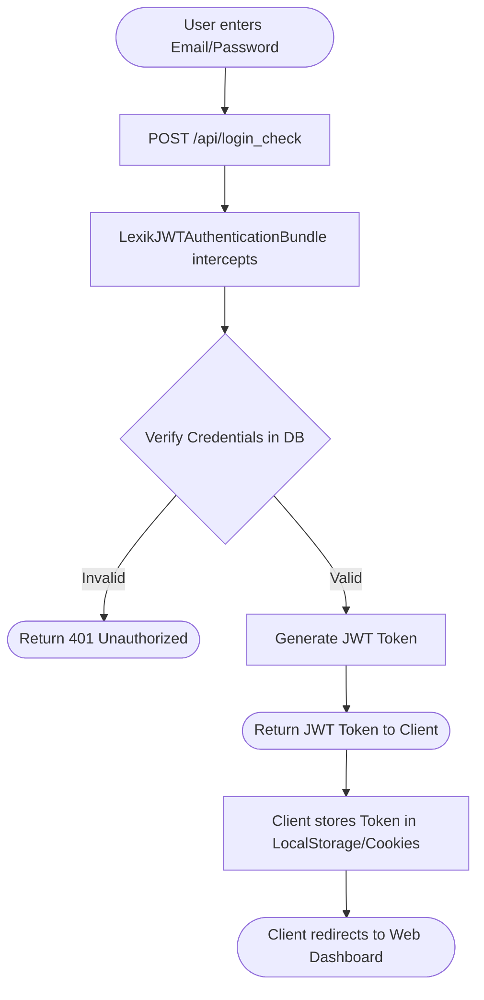

---

## 3. Adding a New Device (with Mercure Hub)

This process connects a physical Android Player to a user's Workspace without requiring the user to type long URLs or credentials into the TV.

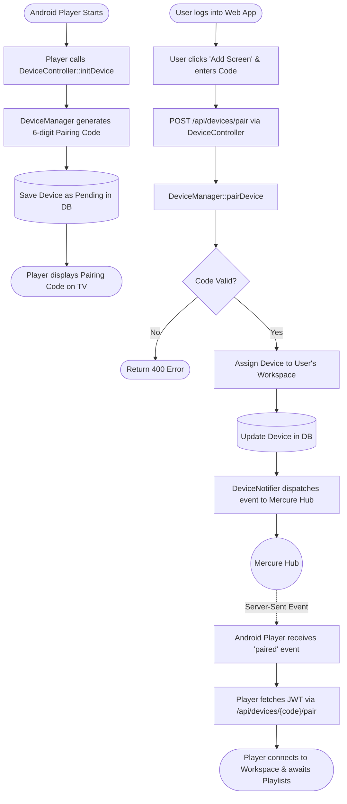

---

## 4. Heartbeat Process for Devices Health Check

To ensure screens are online and functioning, the Android Player sends periodic heartbeats.

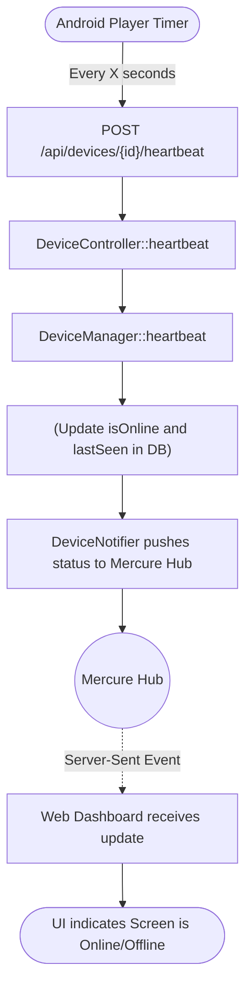

---

## 5. Process for Newly Added Media Upload

Uploading a new video or image from the user's computer, through the Web App, and eventually playing on the Android TV. This utilizes direct-to-cloud uploads to save server bandwidth.

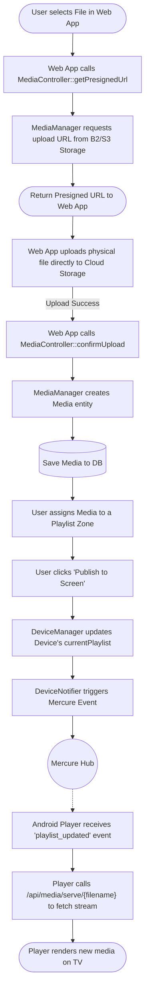

---

## 6. Process for Handling Existing Media

When media is already uploaded, the server simply manages the database records, while the player handles caching to save bandwidth.

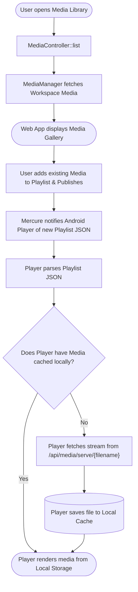

---

## 7. Playlist with Multiple Zones and Sections

How the Android Player safely interprets complex playlists (Sections acting as slides/scenes, Zones acting as widgets on the screen) without mutation or visual tearing.

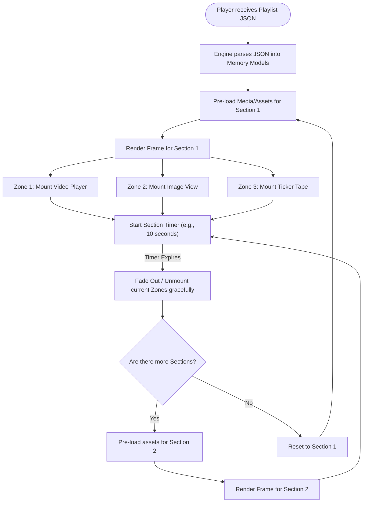

---

## 8. Schedule Creation & Consumption

### Why Symfony Messenger over a basic Cron Job?
Instead of a basic daemon process that polls the database every minute (which causes DB strain, latency, and race conditions), Plaisoram uses **Symfony Messenger with Delay Stamps**. 

When a schedule is created for a future date, a message is immediately dispatched to a Message Queue (like RabbitMQ or Redis) with a specific timestamp. The worker daemon sits completely idle until that exact millisecond. 
- **Precision:** Execution happens exactly when requested, down to the millisecond.
- **Reliability:** If the server crashes during execution, the message queue automatically retries the job.
- **Scalability:** Multiple workers can consume the queue simultaneously without locking database rows.

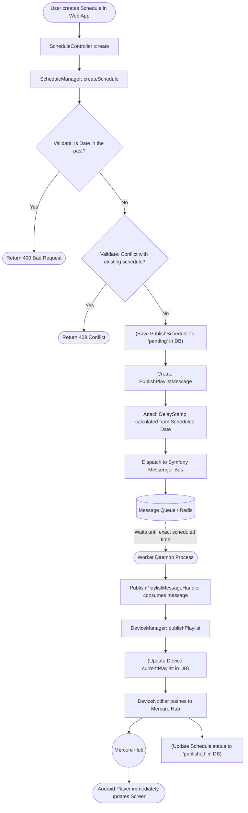

---

## Future Processes to Consider (V2 Architecture)

These processes are critical for scaling Plaisoram into a robust, enterprise-grade digital signage platform.

### A. Offline Resilience & Auto-Recovery
Ensuring the screen never goes black even if the internet drops for days, and recovering automatically after a power loss.

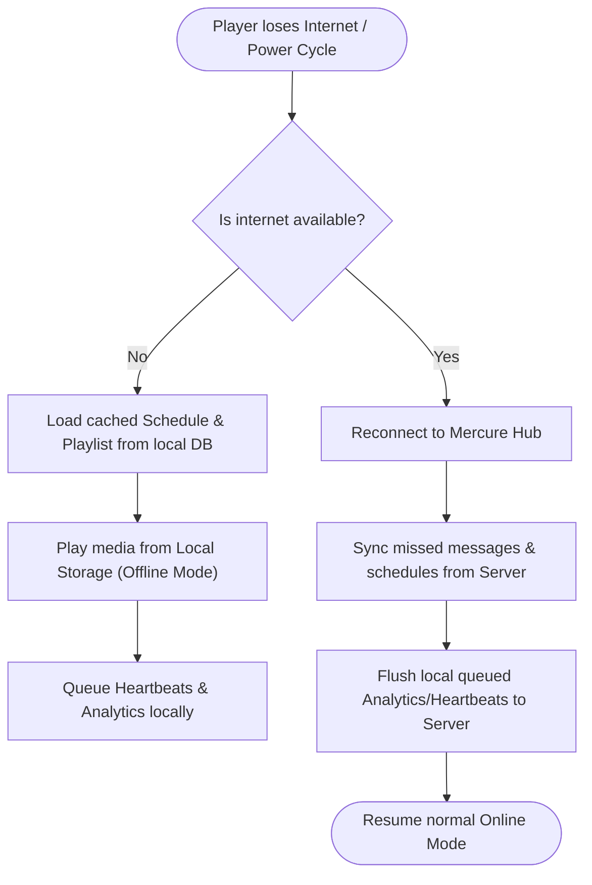

### B. Proof of Play & Analytics Batching
Tracking exactly how many times an ad or media file was played, batched to prevent server overload.

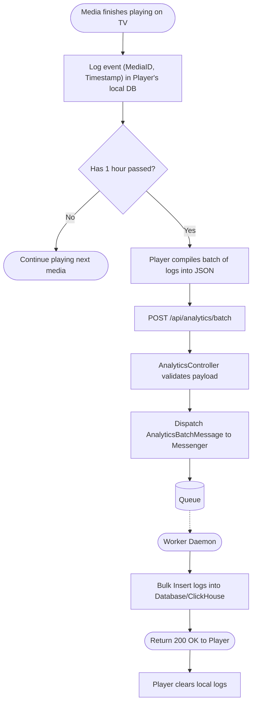

### C. Remote Device Management & OTA Updates
Remotely commanding screens without physical intervention.

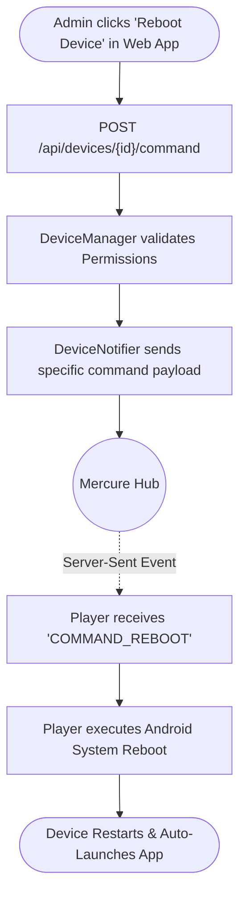
