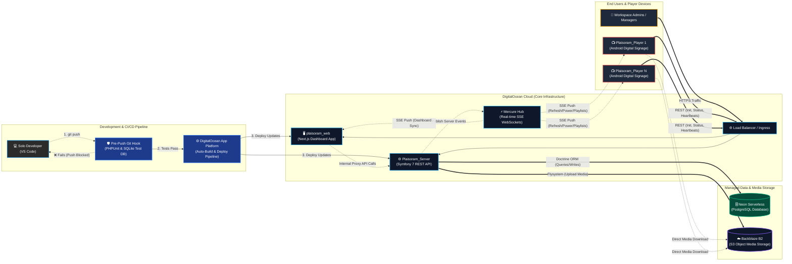

# Plaisoram System Architecture

```mermaid
flowchart LR
    %% Custom Styling Definitions based on your image preference
    classDef dev fill:#2b2b2b,stroke:#007acc,stroke-width:2px,color:#fff
    classDef ci fill:#1e3a8a,stroke:#3b82f6,stroke-width:2px,color:#fff
    classDef server fill:#0f172a,stroke:#38bdf8,stroke-width:2px,color:#fff
    classDef db fill:#064e3b,stroke:#10b981,stroke-width:2px,color:#fff
    classDef storage fill:#0f172a,stroke:#8b5cf6,stroke-width:2px,color:#fff
    classDef user fill:#1e293b,stroke:#f59e0b,stroke-width:2px,color:#fff
    classDef device fill:#1e293b,stroke:#ef4444,stroke-width:2px,color:#fff

    %% 1. Developer Environment & CI/CD
    subgraph Development_and_CI ["Development & CI/CD Pipeline"]
        direction TB
        Dev["💻 Solo Developer<br>(VS Code)"]:::dev
        GitHook["🛡️ Pre-Push Git Hook<br>(PHPUnit & SQLite Test DB)"]:::ci
        DO_Pipeline["⚙️ DigitalOcean App Platform<br>(Auto-Build & Deploy Pipeline)"]:::ci
    end

    %% 2. Core Server Infrastructure
    subgraph Cloud_Infrastructure ["DigitalOcean Cloud (Core Infrastructure)"]
        direction TB
        LB["🌐 Load Balancer / Ingress"]:::server
        Web["🖥️ plaisoram_web<br>(Next.js Dashboard App)"]:::server
        API["⚙️ Plaisoram_Server<br>(Symfony 7 REST API)"]:::server
        Mercure["⚡ Mercure Hub<br>(Real-time SSE WebSockets)"]:::server
    end

    %% 3. External Managed Data Services
    subgraph Data_Storage ["Managed Data & Media Storage"]
        direction TB
        NeonDB[("🗄️ Neon Serverless<br>(PostgreSQL Database)")]:::db
        B2[("☁️ Backblaze B2<br>(S3 Object Media Storage)")]:::storage
    end

    %% 4. End Users and Client Devices
    subgraph Clients ["End Users & Player Devices"]
        direction TB
        Admins["👥 Workspace Admins / Managers"]:::user
        Android1["📺 Plaisoram_Player 1<br>(Android Digital Signage)"]:::device
        Android2["📺 Plaisoram_Player N<br>(Android Digital Signage)"]:::device
    end

    %% ==== DEFINING THE CONNECTIONS ====

    %% Dev Flow
    Dev -. "1. git push" .-> GitHook
    GitHook -- "2. Tests Pass" --> DO_Pipeline
    GitHook -. "❌ Fails (Push Blocked)" .-> Dev
    DO_Pipeline -- "3. Deploy Updates" --> Web
    DO_Pipeline -- "3. Deploy Updates" --> API

    %% Admins to Web
    Admins == "HTTPS Traffic" ==> LB
    LB --> Web
    Web -. "Internal Proxy API Calls" .-> API
    
    %% Android Players to API
    Android1 == "REST (Init, Status, Heartbeats)" ==> LB
    Android2 == "REST (Init, Status, Heartbeats)" ==> LB
    LB --> API
    
    %% Server to Data
    API == "Doctrine ORM (Queries/Writes)" ==> NeonDB
    API == "Flysystem (Upload Media)" ==> B2
    
    %% Android Downloading Media
    Android1 -. "Direct Media Download" .-> B2
    Android2 -. "Direct Media Download" .-> B2

    %% Real-time Updates (Mercure)
    API -. "Publish Server Events" .-> Mercure
    Mercure -. "SSE Push (Refresh/Power/Playlists)" .-> Android1
    Mercure -. "SSE Push (Refresh/Power/Playlists)" .-> Android2
    Mercure -. "SSE Push (Dashboard Sync)" .-> Web
```
