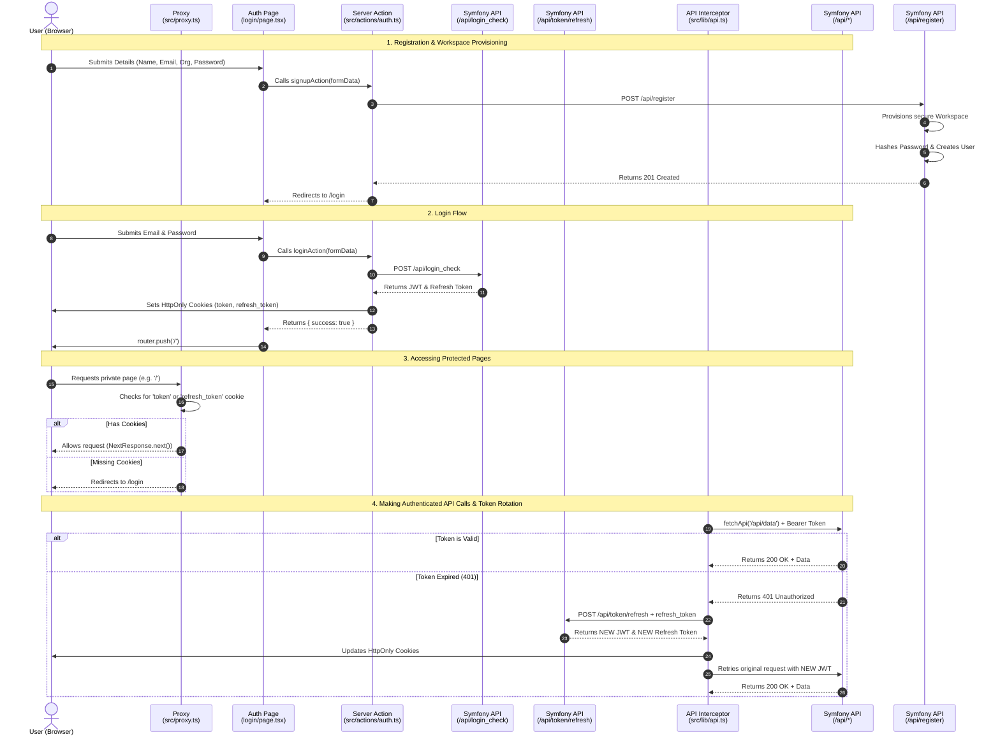

# Authentication Flow Architecture

This document maps out the complete authentication lifecycle between the Plaisoram Next.js Web Frontend and the Symfony Server Backend. It details the steps for logging in, protecting routes, making authenticated requests, and rotating refresh tokens invisibly.

## Sequence Diagram

## Files Involved

### Plaisoram Web (Next.js)
- **`src/app/(auth)/login/page.tsx` & `src/app/(auth)/signup/page.tsx`**: The client-side UI where the user inputs their credentials. They invoke the secure Server Actions instead of making direct HTTP requests to the backend.
- **`src/actions/auth.ts`**: The Backend-For-Frontend (BFF) Server Actions. These run on the Node.js server, call the Symfony backend directly, and set the strict `HttpOnly`, `Secure` cookies.
- **`src/proxy.ts`**: Edge proxy that intercepts every request to the Next.js app to ensure the user possesses an active authentication cookie before allowing them to access private routes.
- **`src/lib/api.ts`**: The `fetchApi` wrapper intended for Next.js Server Components. It automatically extracts the JWT from the cookies, injects it into the `Authorization` header, and handles the transparent 401 retry-with-refresh logic.

### Plaisoram Server (Symfony)
- **`src/Controller/RegistrationController.php`**: Handles the initial `POST /api/register`. It securely hashes the password, automatically provisions a dedicated `Workspace` for multi-tenant data isolation, and bonds the new user to this Workspace.
- **`src/Controller/*Controller.php`**: Protected endpoints (Devices, Media) automatically extract the `Workspace` from the authenticated user's JWT to guarantee data silos.
- **`config/packages/security.yaml`**: The security nerve center. Configures the `login` firewall (for `json_login`), the `api_token_refresh` firewall, and the stateless `api` firewall. Enforces rate limits (`login_throttling`).
- **`config/packages/gesdinet_jwt_refresh_token.yaml`**: Configures the long-lived refresh tokens with `single_use: true` (token rotation).
- **`src/Entity/User.php` & `src/Entity/RefreshToken.php`**: The Doctrine entities mapping user identities and valid refresh tokens to the database.
