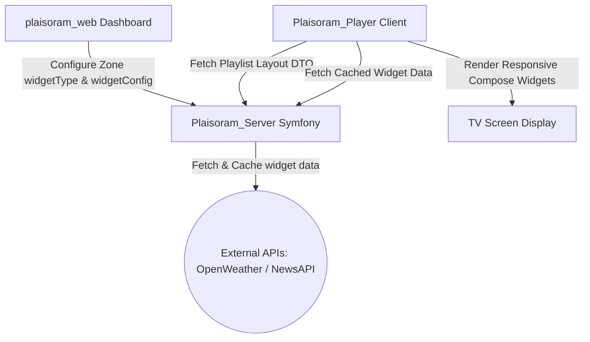

# Design Blueprint: Weather & News Widgets

This document describes the technical architecture and implementation blueprint of the **News** and **Weather** widgets across the Plaisoram system.

---

## 1. System Architecture Overview



---

## 2. Database Schema & API Payload

### PostgreSQL Entity (`Zone.php`)
Widgets are modeled directly in the layout's `Zone` ORM entity. When a zone holds a widget, its `media_id` is null, and the widget properties are filled:
* `widget_type` (`string|null`): Type of the widget (`"weather"` or `"news"`).
* `widget_config` (`json|null`): Key-value parameters (e.g., `{"country": "MA", "city": "Casablanca"}`).

### API Playlist Endpoint (`/api/devices/{id}/playlist`)
When the player polls for layouts, the server serializes the widget configurations into the JSON schema:
```json
{
  "zoneId": "sidebar",
  "widgetType": "weather",
  "widgetConfig": { "country": "MA", "city": "Casablanca" },
  "media": null
}
```

---

## 3. Server-Side Cache Proxy (`WidgetController.php`)

To prevent exposing API keys to the client and avoid rate-limiting issues, the server proxies external requests with a **Stale-While-Revalidate Caching Layer**:

1. **Weather Proxy (`GET /api/widgets/weather?city={city}&country={country}`)**:
   * Caches results in the filesystem/Redis for **15 minutes** (900s).
   * Fetches OpenWeatherMap API using server-level env parameters.
   * **Stale-While-Revalidate Fallback**: If OpenWeatherMap is offline or throttled, it catches the error and returns a mock offline response so the TV never crashes or displays a blank screen.
2. **News Proxy (`GET /api/widgets/news?country={country}&category={category}`)**:
   * Caches results for **30 minutes** (1800s).
   * Fetches NewsAPI using server-level env parameters.
   * **Stale-While-Revalidate Fallback**: Returns a mock ticker article if NewsAPI is unreachable.

---

## 4. Web Dashboard Layout Editor (`plaisoram_web`)

The Web Dashboard handles widget assignment while enforcing spatial layout constraints:
* **Constraint Validation (`MediaPickerModal.tsx`)**:
  * **Sidebar zones**: Enables weather widget configurations (which triggers the selection popup).
  * **Header & Footer zones**: Enables general news ticker configurations.
  * **Main zones**: Restricts assignment to Video & Image content only (blocks widgets to ensure user experience stability).
* **Dropdown Selection Popup (`WeatherConfigModal.tsx`)**:
  * Displays a pre-filtered list of supported countries (France, Morocco, USA, UK, Spain, Germany, UAE, Saudi Arabia) and their major cities to ensure configuration reliability.

---

## 5. Android Player Layout Compositor (`Plaisoram_Player`)

The client application resolves layouts dynamically and overlays widgets onto the Compose tree:

### A. Data Fetching
* **DTO Mapping**: Resolves `PlaylistLayoutDto` which translates the zones.
* **Domain Use Cases**: `GetWeatherUseCase.kt` and `GetNewsUseCase.kt` query the server proxy endpoints on a recurring background loop (Weather every 15 minutes, News every 30 minutes).

### B. Compose UI Renderers
1. **Weather Widget (`WeatherWidget.kt`)**:
   * Wrapped inside a responsive `BoxWithConstraints`.
   * **Container-Proportional Scaling**: Automatically calculates font sizes and icon sizes based on the container's height using `.coerceIn()` constraints. This ensures the text and icons look proportional on a small 720p screen, a Full HD display, or a large 4K billboard.
   * Safe truncation using `TextOverflow.Ellipsis` ensures layout elements never break or wrap onto multiple lines.
2. **News Ticker (`NewsWidget.kt`)**:
   * Designed for horizontal header and footer banners.
   * Features a rotating article display using a vertical marquee transition (`AnimatedContent`) every 8 seconds.
   * Keeps headlines single-line with an ellipsis (`...`) if the screen width is narrow.

### C. Single Audio Master (Audio Collision Protection)
When multiple videos are playing simultaneously (e.g. in double main configurations), the `ZonedLayoutRenderer` manages audio streams:
* Primary zones (`main` or `main1`) play with volume set to `1.0f`.
* Secondary zones (`main2`) are automatically muted (`volume = 0.0f`).
